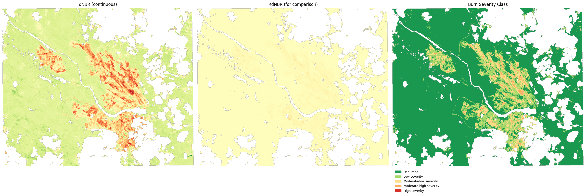

# Wildfire Burn Severity Mapping, Ljusdal, Sweden (2018)

Maps burn severity from the 2018 Ljusdal wildfire using Sentinel-2 L2A imagery,
via the Normalized Burn Ratio (NBR) / differenced NBR (dNBR) method.



## Summary

- **AOI:** ~20 km × 20 km bounding box around Ljusdal, Sweden
- **Data:** Sentinel-2 L2A surface reflectance, via the Copernicus Data Space Ecosystem
- **Pre-fire scene:** 2018-07-02
- **Post-fire scene:** 2018-09-02
- **Method:** NBR (NIR/SWIR band ratio) → dNBR → classified into 5 severity classes

## Method

1. **AOI & scene search** - define the fire extent as a WGS84 polygon, query the
   Copernicus ODATA catalogue for cloud-free Sentinel-2 L2A scenes before and
   after the fire.
2. **Preprocessing**  clip both scenes to the AOI, mask cloud/shadow/water
   pixels using the Scene Classification (SCL) band, export NIR (B8A) and SWIR
   (B12) as GeoTIFFs.
3. **Analysis** - compute NBR for each date, difference them into dNBR, compute
   RdNBR as a vegetation-vigor-normalized comparison layer, classify dNBR into
   5 severity classes (USGS/FIREMON thresholds), and export a colored,
   georeferenced severity raster.

```
NBR  = (NIR − SWIR) / (NIR + SWIR)
dNBR = NBR_pre − NBR_post
```

| dNBR range | Class |
|---|---|
| < 0.10 | Unburned |
| 0.10 – 0.27 | Low severity |
| 0.27 – 0.44 | Moderate-low severity |
| 0.44 – 0.66 | Moderate-high severity |
| > 0.66 | High severity |

## Repo structure

```
01_data_collection.ipynb   # AOI, scene search, download, extract
02_preprocessing.ipynb     # AOI clipping, cloud/water masking, band export
03_analysis.ipynb          # NBR / dNBR / RdNBR, severity classification, GeoTIFF export
requirements.txt
.env.example                # copy to .env and fill in your CDSE credentials
data/
  raw/                     # downloaded .SAFE scenes (gitignored, regenerate via notebook 01)
  processed/               # intermediate + final GeoTIFFs and figures (gitignored)
```

## Setup

```bash
pip install -r requirements.txt
cp .env.example .env   # then fill in CDSE_USERNAME / CDSE_PASSWORD
```

Credentials are free, register at
[dataspace.copernicus.eu](https://dataspace.copernicus.eu).

## Running

Run the notebooks in order: `01_data_collection.ipynb` →
`02_preprocessing.ipynb` → `03_analysis.ipynb`. Each stage writes its outputs
to `data/`, which the next notebook reads back in.

## Limitations

- Single pre/post image pair, some of the measured NBR change reflects normal
  July to autumn seasonal vegetation change, not fire, since no unburned control
  area or prior-year baseline was differenced out.
- Severity thresholds are standard literature values, not calibrated or
  validated against ground truth or an independent burned-area product
  (e.g. Copernicus EMS/EFFIS) for this specific fire.
- Cloud/shadow/water masking uses the SCL band only; no gap-filling
  (compositing) was applied, so masked pixels appear as no-data in the output.

## Data & attribution

Contains modified Copernicus Sentinel data, processed via the Copernicus Data
Space Ecosystem.